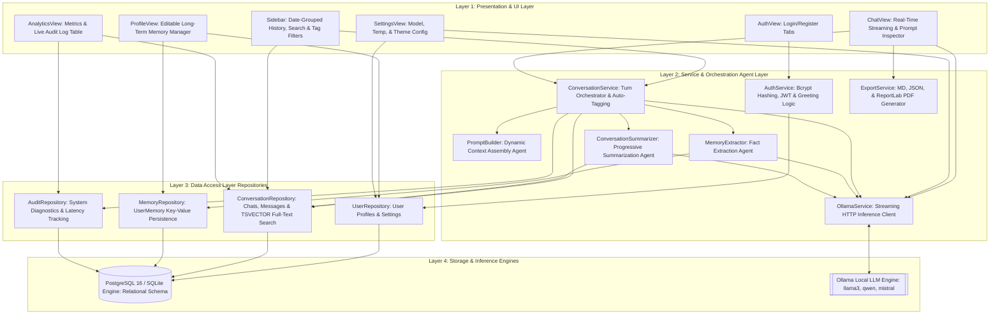
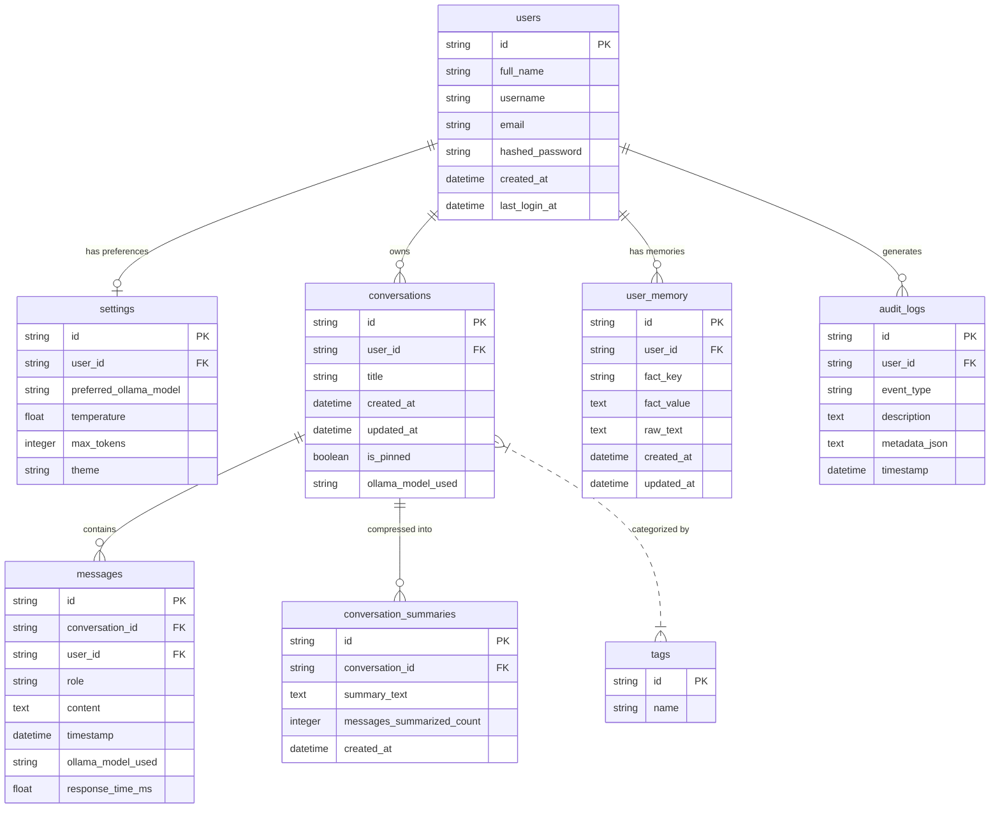
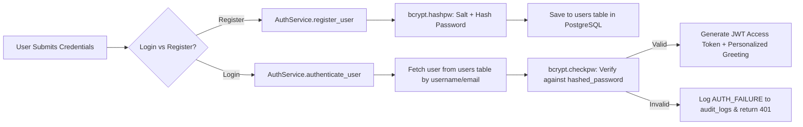

# 🏗️ System Architecture & Engineering Blueprints: Intelligent AI Chatbot

This document outlines the **multi-layered architectural design**, **component interaction diagrams**, **data pipelines**, and **normalized relational schema** powering the Intelligent AI Chatbot Application.

---

## 🏛️ 1. High-Level System Architecture

The application is architected around a **Service-Repository Pattern** that enforces strict separation of concerns across four distinct layers:

---

## 🔁 2. Retrieval-Augmented Memory Construction Pipeline

Before every turn is sent to the local Ollama LLM, `PromptBuilder.build_messages_payload()` dynamically constructs an enriched context package:

```mermaid
sequenceDiagram
    autonumber
    actor User
    participant Streamlit as Streamlit UI ChatView
    participant ConvSrv as ConversationService Orchestrator
    participant Repo as PostgreSQL Repositories
    participant Prompt as PromptBuilder Agent
    participant Ollama as Ollama Engine (llama3)
    participant Extractor as MemoryExtractor Agent

    User->>Streamlit: Submits Prompt ("Where do I live and what's my dog's name?")
    Streamlit->>ConvSrv: send_message_and_stream_response(user_id, conv_id, prompt, model)
    ConvSrv->>Repo: add_message(conv_id, user_id, role="user", content=prompt)
    
    rect rgb(20, 40, 60)
        Note over ConvSrv,Prompt: RAG Memory Retrieval Pipeline
        ConvSrv->>Repo: get_user_memories(user_id)
        Repo-->>ConvSrv: List of UserMemory facts [location: Bangalore, dog's name: Bruno]
        ConvSrv->>Repo: get_latest_summary(conv_id)
        Repo-->>ConvSrv: ConversationSummary (or None if turns < 30)
        ConvSrv->>Repo: get_messages(conv_id, limit=10)
        Repo-->>ConvSrv: Recent Message Window
        ConvSrv->>Prompt: build_messages_payload(user, memories, summary, window, prompt)
        Prompt-->>ConvSrv: Enriched payload [{role: "system", content: "You remember facts..."}, ...]
    end

    ConvSrv->>Ollama: generate_stream(payload, model="llama3", temp=0.7)
    
    loop Real-Time Token Streaming
        Ollama-->>ConvSrv: Yield Token Chunk
        ConvSrv-->>Streamlit: Stream Token Chunk (`st.write_stream`)
    end

    Streamlit-->>User: Complete Assistant Response Rendered in UI

    ConvSrv->>Repo: add_message(conv_id, role="assistant", content=full_response, response_time_ms)
    
    rect rgb(40, 20, 40)
        Note over ConvSrv,Extractor: Asynchronous Background Maintenance & Learning
        ConvSrv-)Extractor: extract_and_store(user_id, prompt)
        Extractor-)Ollama: Extract new personal facts (`JSON` output)
        Extractor-)Repo: create_or_update_memory(user_id, fact_key, fact_value)
        ConvSrv-)Repo: log_event("OLLAMA_RESPONSE", "Generated turn in 1420ms")
    end
```

---

## 📊 3. Entity-Relationship Schema (SQLAlchemy Models)

---

## 🔒 4. Security & Authentication Architecture

